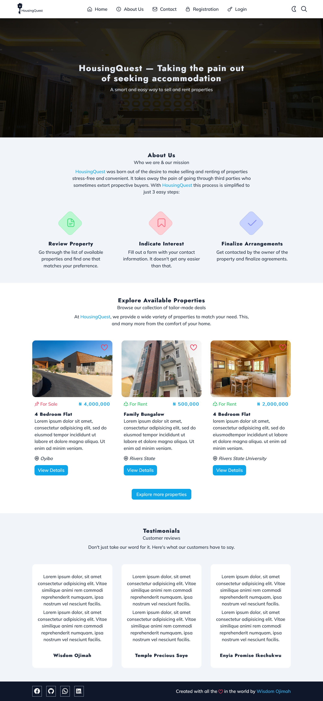
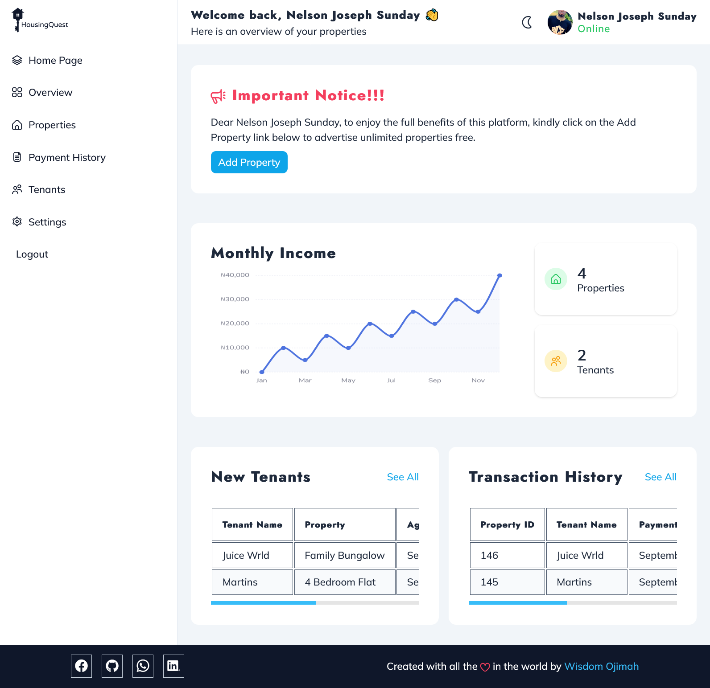
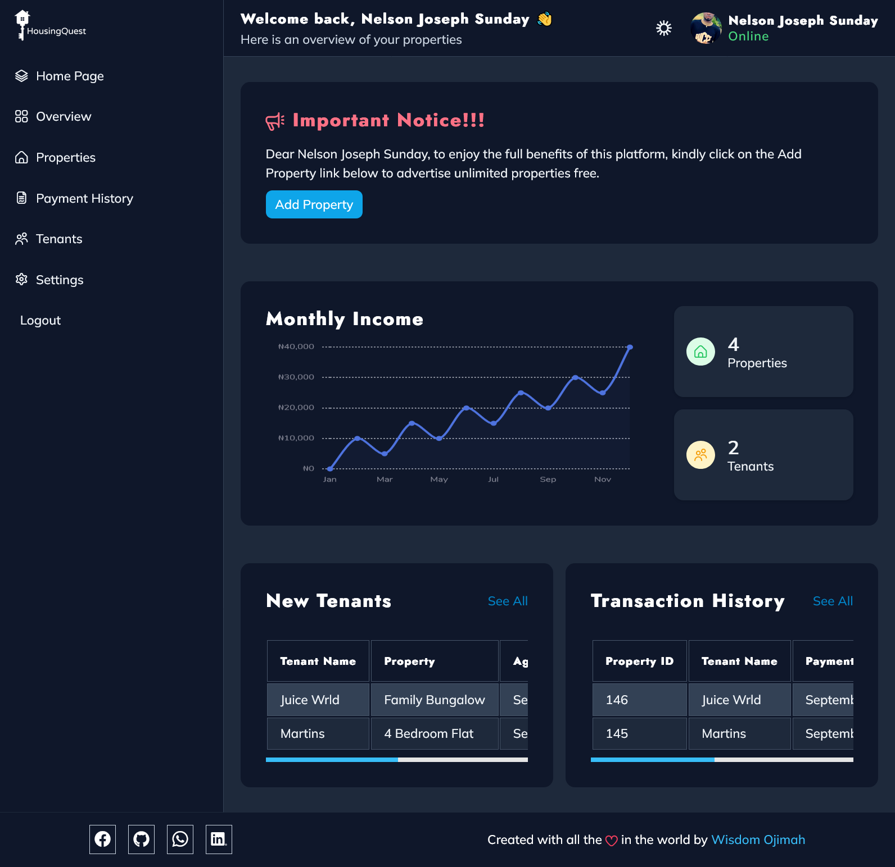
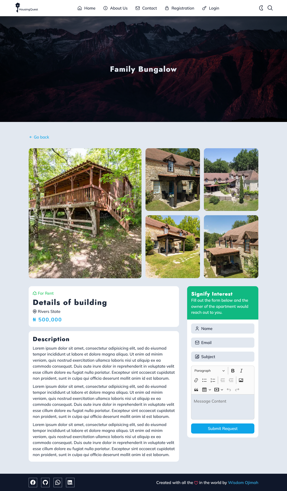
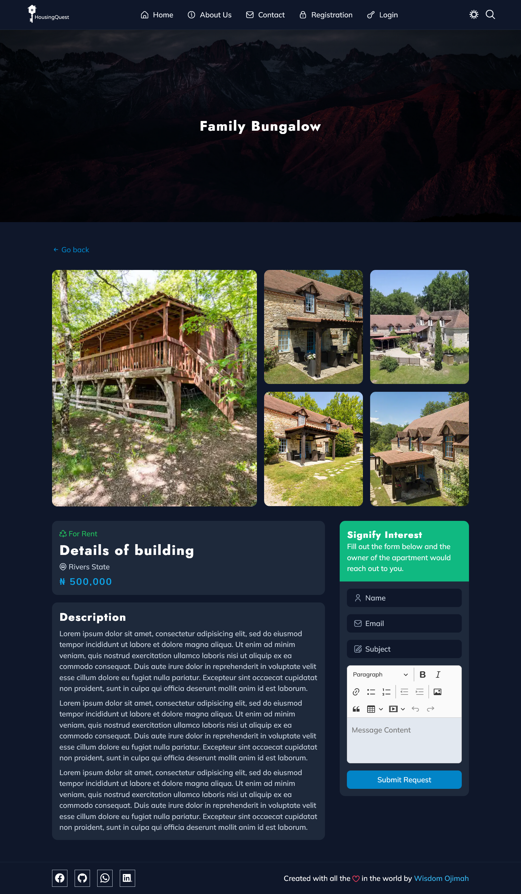
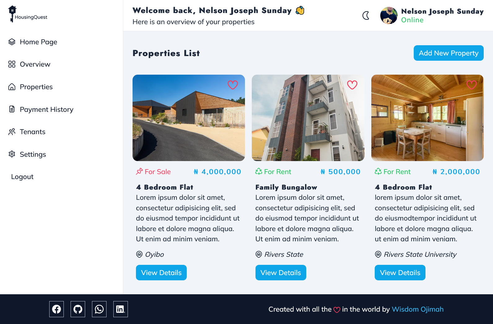
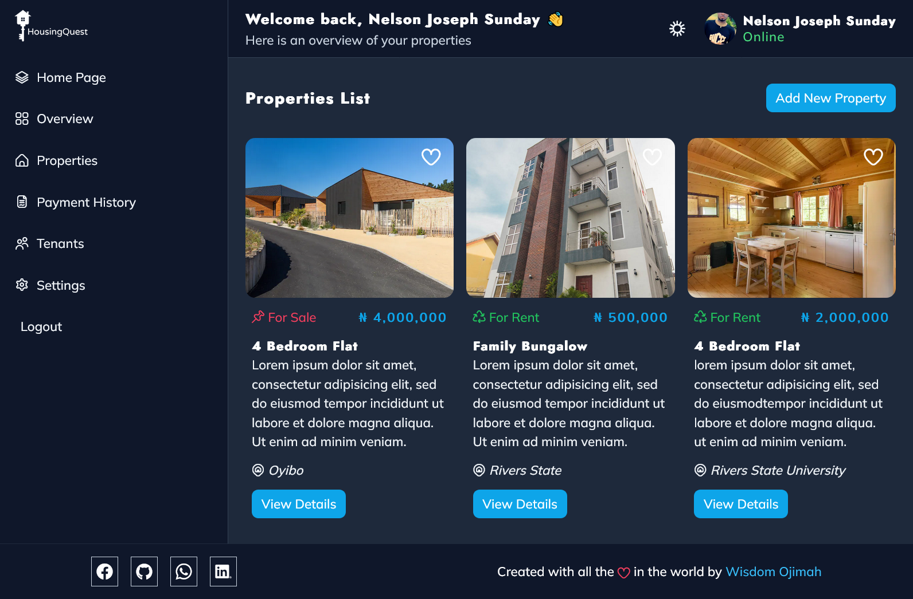

# Apartment Rental System

## Intro

The aim of this work is to ease the process of searching for suitable accomodation. This work consists of a general hompage where prospective tenants can go through listings of available accomodation. They can also search for accomodation based on the price range, location, and type of accomodation. This README would be updated as I complete different sections of this project.

## Stages

- Completed the first version of the static home page and hosted it on GitHub pages and Netlify. The live demo url can be found on [http://housingquest.unaux.com/](http://housingquest.unaux.com/)

- Made the contact, register, login, and reset password pages.

- Implemented a theme changer feature.

- Further improved the theme changer by changing the the theme toggle icon based on the selected theme and also harmonizing the styles across multiple pages.

- Created the details page for individual apartments.

- Started design of the admin dashboard.

- Finished a rough v1 of the admin dashboard homepage.

- Changed file extensions from ```.html``` to ```.php```.

- Cleaned up the design of the admin dashboard homepage, unified the theme to switch the logo's when the theme is changed.

- Made the admin property listing page, the admin view property page, as well as the confirm delete property dialog.

- Made the payment history page and also carried out minor design changes to the tables.

- Made the tenants listing page and also added the charts for monthly income.

- Made the settings page and other minor changes.

- Made the edit property page.

- Made the add new property page.

- Carried out more refactoring and added finishing touches to certain things.

- Friday July 1st, 2022. Made the registration system (for landloards). It checks if all necessary fields have been filled in, makes sure that the email is a valid one, and also makes sure that the phone number and/or email entered isn't one that has already been taken.

- Saturday July 2nd, 2022. Made the login system (for landlords).

- Saturday July 2nd, 2022. Implemented the password reset feature. It sends a mail to the user that contains the new password.

- Carried out minor fixes to the overall design of the website.

- Implemented the add new property feature.

- Implemented the add new property feature.

- Corrected the broken stylesheets and JavaScript files links.

- Corrected a bug where only the last selected image was uploaded in the add new property page.

- Added the index page apartment listing functionality and fixed an inconsistent image names issue.

- Made the view properties functionality for property owners and logout functionality.

- Made the contact form functionality.

- Made the view total owned properties and tenants feature for the admin index page, and also the view tenants table for the tenants page in the admin dashboard.

- Made the update profile picture feature and added file extension checks before uploading images.

- Made the user's details update feature (records such as name, phone number, email, and password can now be changed).

- Made the view individual property details functionality for both the index and admin dashboard.

- Made the delete property functionality.

- Made the edit property functionality (This took a lot of time to figure out as I had to look for a way to keep track of what was being updated and update the tables in the database accordingly).

- Added a WYSIWYG editor to provide text formatting for inputs.

- Designed the search input that allows cutomers search for available apartments

- Implemented the search for property feature. Users have the option to either enable strict search which would make sure the search results match exactly with what they're expecting or they can disable strict search which would make sure that the search results contain the search term. There are also certain fields such as property type, location of the property, and price range that can be used to narrow down the search results.

- Implemented the contact property owner feature for individual apartments (the form to signify interest for an apartment)

- Created the view all properties page where all available properties are listed.

- Implemented the add new tenant feature. After adding a new tenant it uses the data from the `add tenant` form to populate the transaction table accordingly. It finally sets the status of the property that has just been purchased/rented to `taken`.

- Added a feature to show the a summary of new tenants/transactions in the admin homepage.

- Fixed a bug where the price column was a string and as such the search form wasn't comparing the values correctly.

- Carried out minor design harmonization.

- Fixed a bug where the transaction history and list of tenants was shown on the admin dashboard without checking if the logged admin is the property owner and initiator of the transaction.

- Implemented a feature where a success email is sent to the tenant once the property has been assigned to him/her.

- Prevent users from seeing the details of a property that has already been taken.

- Fixed registration form expanding to fill the entire screen on desktop devices when registration is complete.

- Imporved the information contained in the user request for apartment email. Details such as the apartment choosen is now included.

## Features

- Admin (property owner login)
- Property upload
- Prospective tenant and property owner chat using emails
- Poperty details modification
- Property deletion
- Admin profile management (names, emails, phone numbers, profile picture, etc can be changed anytime)
- Other features that make usage of this system enjoyable

### N/B
Due to free hosting limitations, PHP's mail functionality might be disabled making it impossible to receive emails. You can alternatively use PHPMailer (you can contact me if you don't know how to set it up).

## Installation

This system uses Apache and MySQL. It is therefore necessary to have an Apache server (XAMPP or Laragon would do). PHP 8 or later is also required. For XAMPP it comes automatically with the latest version of the software. For Laragon download the latest version of PHP from [https://www.php.net/downloads.php](https://www.php.net/downloads.php). In most cases you also need to update your Apache. Nothing a quick Google search won't solve (you can [reach me if you have issues setting it up on your own](https://w.me/+2348105008304)).

After setting up your local server, clone this repo to the `www` folder for Laragon users and the `htdocs` folder for XAMPP users. To get the `www` folder go the `C:\laragon`, while the `htdocs` folder can be located by going to `C:\xampp`. Inside the cloned repo there is an `installation folder.` Open the folder, open your database management system (MySQL Workbench or the database that comes with either XAMPP or Laragon would do) and create a new database called `housingquest` and then import the `db.sql` file that's found in the `installation folder.`

If everything is set up right, open your browser and go to `localhost/hosuingquest` for XAMPP users or `housingquest.test` for Laragon users.

## Screenshots

Below are snapshots of some parts of the system:
















## Going Forward

Pull Requests are welcome.
